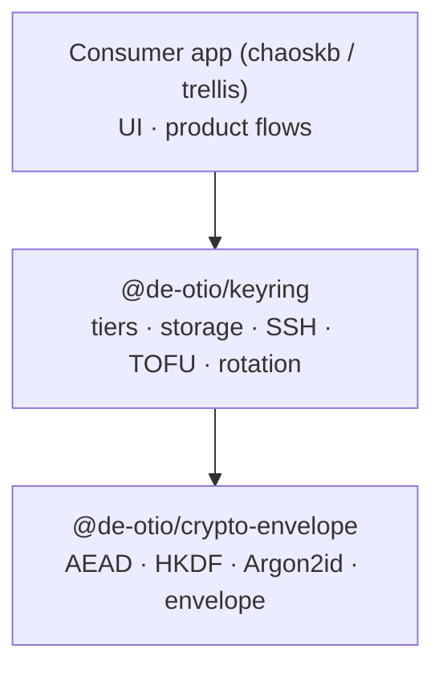

# @de-otio/keyring

> ⚠️ **Pre-alpha.** Public API under construction. Runtime classes are stubbed until Phase B+ lands. See [plans/01-extraction.md](./plans/01-extraction.md) for the roadmap.

Key-lifecycle layer on top of [`@de-otio/crypto-envelope`](https://github.com/de-otio/crypto-envelope). Provides the tier model (SSH-wrap / Argon2id-passphrase), storage backends (OS keychain, WebExtension MV3, IndexedDB, filesystem), SSH interop, TOFU pinning, project-key wrapping, ECDH invite flow, and resumable rotation orchestration.

## Scope boundary

| Package | Owns |
|---|---|
| `@de-otio/crypto-envelope` | AEAD, HKDF, Argon2id/PBKDF2, canonical JSON, envelope v1/v2, `SecureBuffer`, `rewrapEnvelope` primitive |
| `@de-otio/keyring` | Tier model, storage backends, SSH interop, TOFU, project keys, invite flow, rotation orchestration, optional audit-event sink |
| Consumer (chaoskb / trellis) | App storage, product flows (device linking, sync, voting, ActivityPub), UI |



## Install

```sh
npm install @de-otio/keyring@alpha
```

Also requires `@de-otio/crypto-envelope@>=0.2.0-alpha.1 <0.3.0` as a peer dependency.

For browsers (chaoskb plugin, trellis frontend):

```ts
import { KeyRing, StandardTier, WebExtensionStorage } from '@de-otio/keyring/browser';
```

The `/browser` subpath is the escape-hatch when bundler resolution doesn't auto-select the `browser` condition.

## Quick-use (once Phase B+ lands)

```ts
import {
  KeyRing,
  MaximumTier,
  OsKeychainStorage,
} from '@de-otio/keyring';

await using ring = new KeyRing({
  tier: MaximumTier.fromPassphrase(),
  storage: new OsKeychainStorage({ service: 'my-app' }),
});

await ring.unlockWithPassphrase('correct horse battery staple');

await ring.withMaster(async (master) => {
  // use master via @de-otio/crypto-envelope EnvelopeClient
});
```

## Design principles

1. **Safe by construction.** Passing a passphrase-derived master to browser-scoped storage is a **compile-time error** (capability-typed `KeyStorage<K>`), not a runtime refusal. Mlock-less browser buffers require explicit `insecureMemory: true` acknowledgement at the `KeyRing` constructor.
2. **Resumable rotation.** `ring.rotate(newTier, enumerator)` returns a cursor (`lastPersistedId`) consumers persist and feed back on resume. Bounded concurrency (`batchSize`) prevents OOM on large KBs. Old master is retained until rotation completes (`oldMasterStillRequired: false`).
3. **No UI in the library.** Passphrases come from the consumer. Keyring never prompts, displays, or caches credentials.
4. **No audit log owned.** Optional `EventSink` emits lifecycle events; consumer persists wherever their audit pipeline lives.

## Browser posture

| Runtime | Supported | Notes |
|---|---|---|
| Node ≥ 20 | ✅ | OS keychain via `@napi-rs/keyring`; SSH agent via socket IPC; mlock via `sodium-native` |
| Chrome / Chromium ≥ last-2 | ✅ | MV3 extensions + pages; strict-by-default SecureBuffer; `chrome.storage.local` / `session` |
| Firefox ESR | ✅ | MV3 + `browser.storage.local` |
| Safari ≥ last-2 | ✅ | Extension only; no `IndexedDbStorage` tests (pending Safari Web Extensions parity) |
| Deno ≥ 2.0 | ✅ | Node-compat; uses `@napi-rs/keyring` optional dep or falls back to `FileSystemStorage` |
| Bun ≥ 1.2 | ✅ | Same as Deno |
| Cloudflare Workers / Vercel Edge | ✅ | `FileSystemStorage` disabled; `InMemoryStorage` only |
| MV2 | ❌ | Explicitly unsupported |

## Security

See [SECURITY.md](./SECURITY.md) for the threat model, browser posture, `sshpk` acceptance window, StandardTier EU adequacy notes, and TOFU integrity guarantees.

## Licence

MIT © De Otio. See [LICENSE](./LICENSE).
